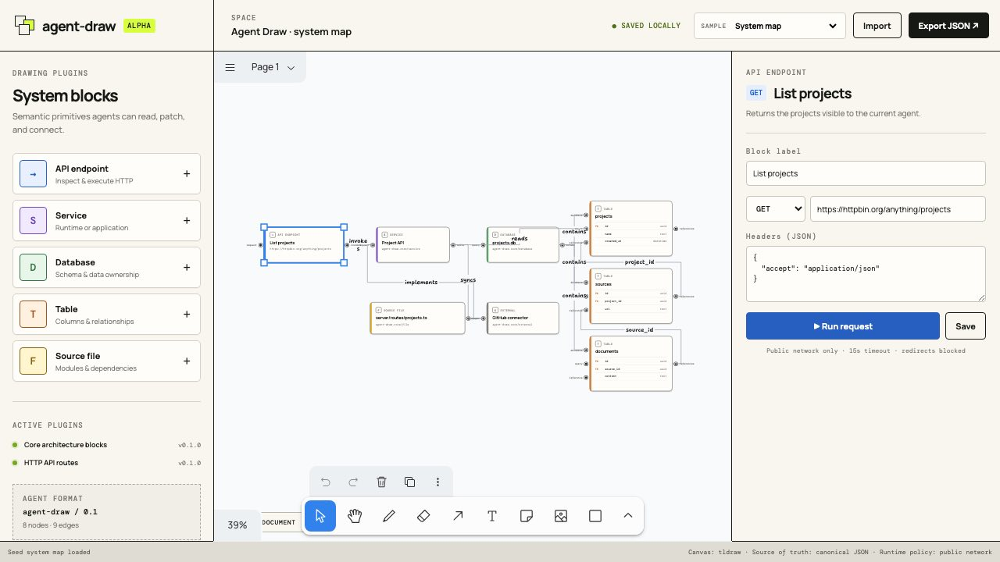

# agent-draw

An agent-first technical canvas. Humans arrange and inspect a tldraw canvas; agents read and patch a renderer-independent, versioned graph document.

> **Alpha:** the document boundary is deliberate; the plugin SDK and compatibility
> guarantees are still evolving.



The first vertical slice includes:

- a tldraw-based technical canvas with API, service, database, table, file, and external-system blocks;
- inspectable table columns and semantic edges for database ownership, service reads, and foreign-key references;
- custom React node shapes with named input/output handles and typed, snapping connections;
- canonical `agent-draw/0.1` JSON with stable IDs, semantic edges, named views, capabilities, and forward-compatible extensions;
- `agent-draw-patch/0.1` operations with optimistic revision checks;
- build-time plugin registration with namespaced node types and declared capabilities;
- an API inspector that edits and runs HTTP requests through a guarded local capability runtime;
- JSON import/export and browser-local persistence;
- a TypeScript CLI and stdio MCP server for agent-authored reads, imports, connection proposals, and optimistic patches.

## Run it

Requirements: Node 20+ and pnpm.

```sh
pnpm install
pnpm dev
```

Open `http://127.0.0.1:4173`. The canvas runtime listens only on `127.0.0.1:4174` and Vite proxies `/api` to it.

Use the sample picker in the header, or open a sample directly:

- `/?sample=system-map`
- `/?sample=agent-loop`
- `/?sample=plugin-system`
- `/?sample=openapi-projects`

```sh
pnpm test
pnpm typecheck
pnpm build
```

## Agent workflow

1. Export a `.agent-draw.json` document from the UI or read one from the project.
2. Preserve IDs and unknown `extensions` fields.
3. Prefer a small `agent-draw-patch/0.1` proposal over rewriting the full document.
4. Set `baseRevision` to the source document's revision.
5. Change semantic fields separately from layout (`setLayout`).
6. Validate before applying. A stale patch must be regenerated against the latest revision.

See [the example patch](examples/add-api-route.agent-draw-patch.json) and [format reference](docs/FORMAT.md).

The CLI exposes the same model operations used by the canvas:

```sh
pnpm agent-draw validate path/to/map.agent-draw.json
pnpm agent-draw import-openapi openapi.yaml -o map.agent-draw.json
pnpm agent-draw connect map.agent-draw.json \
  --source service-api/calls \
  --target database-projects/query \
  -o connection.agent-draw-patch.json
pnpm agent-draw apply map.agent-draw.json connection.agent-draw-patch.json --write
```

## MCP server

`pnpm mcp` runs the TypeScript stdio server. Point an MCP client at the project and confine its file access with `AGENT_DRAW_ROOT`:

```json
{
  "mcpServers": {
    "agent-draw": {
      "command": "pnpm",
      "args": ["--dir", "/absolute/path/to/agent-draw", "mcp"],
      "env": { "AGENT_DRAW_ROOT": "/absolute/path/to/your/project" }
    }
  }
}
```

The first tool set is intentionally graph-level: `read_document`, `list_plugins`, `propose_connection`, `apply_patch`, and `import_openapi`. See [Agent tools](docs/AGENT_TOOLS.md).

## Security model

Diagram files contain capability references, never credentials. The host owns capability grants. The MVP HTTP runtime:

- supports explicit HTTP methods only;
- blocks localhost, private, link-local, `.local`, embedded credentials, redirects, and non-HTTP schemes;
- limits input/body sizes, response size, and duration;
- executes only after the human presses **Run request**.

This is a useful baseline, not a production-grade network sandbox. A deployed version should also isolate execution, resolve DNS again at connection time, add per-space allowlists, and store auditable grants.

## Architecture

`src/model` is the source of truth. `src/canvasAdapter.ts` is the tldraw adapter. `src/plugins` contains manifests and semantic helpers. `src/runtime` is the browser client; `server` is the trusted local capability runtime.

The canvas borrows React Flow's useful interaction semantics—visible handles, compatible endpoints, and typed connections—without adopting a second scene graph. tldraw owns selection, camera, spatial transforms, and rendering. The canonical Agent Draw document owns node IDs, ports, edges, and revisions. A UI gesture is translated into the same `agent-draw-patch/0.1` proposal used by the CLI and MCP server.

The plugin boundary borrows BB's useful separation between a declarative manifest, frontend surfaces, and bounded host capabilities. It intentionally does not expose the tldraw store as a plugin contract.

## Configurability direction

The current blocks are in-process TypeScript plugins. The intended next step is
to make most blocks declarative without weakening the canonical model:

1. **Block schema:** manifests declare fields, ports, defaults, appearance, and
   compatible relationships.
2. **Generated inspector:** the host renders ordinary field editors from that
   schema; plugins provide custom React panels only for genuinely specialized
   interactions.
3. **Importers and adapters:** SQL/ORM/OpenAPI/repository scanners translate
   external systems into stable nodes and patches with provenance.
4. **Host capabilities:** blocks reference connector or secret IDs, while the
   trusted host owns credentials and approves runtime actions.
5. **Agent tools:** MCP exposes the same schema catalog and patch operations as
   the UI, so agent-authored diagrams remain inspectable and reviewable.

This gives common blocks a low-code path while preserving typed escape hatches
for API execution, live database inspection, and other richer utilities.
